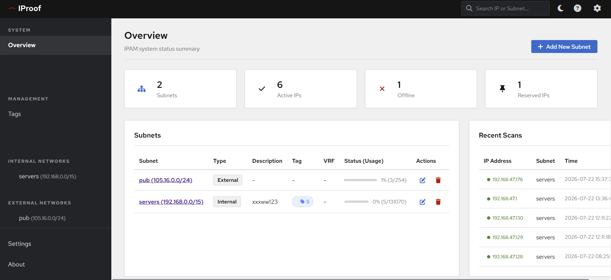
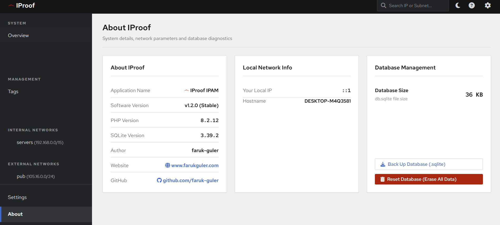

# IProof - IPAM (IP Address Management System)

**IProof** is a lightweight, modern, and high-performance IP Address Management (IPAM) application designed to track, scan, and manage your subnets, IP addresses, and network devices efficiently.

---

## 📸 Screenshots

### System Overview & Dashboard



### System Info & Database Diagnostics



---

## 🚀 Key Features

- **Subnet Management**: Full support for CIDR masks, VRFs, and Master Subnets (nested folder hierarchy).
- **IP Address Tracking**: Live status tracking (Active, Free, Reserved, Offline), Hostname, and MAC address management.
- **Diagnostic Tools**:
  - Real-time **IP Ping** and **Port Scanning**
  - Automated **Subnet ICMP Ping Sweep**
  - **SNMP Discovery** for automated router and device detection
- **Tagging System**: Group and filter subnets/IPs using customizable color-coded tags.
- **Import & Export**: Bulk import and export IP address records in CSV format.
- **Role-Based Access Control**: Separate **Admin** and **Read-Only** permission levels.
- **Automated Cron Scanning**: `cron_scan.php` script for background host status updates.

---

## 🛠️ Installation & Requirements

### System Requirements

- **Web Server**: Apache, Nginx, or IIS
- **PHP**: PHP 7.4+ with `pdo_sqlite` and `sockets` extensions enabled
- **Database**: SQLite3 (automatically initialized, no separate DB server setup required)

### Quick Start

1. Copy all project files to your web server root directory (e.g., `htdocs` or `www`).
2. Open your web browser and navigate to the application URL.
3. **Default Credentials**:
   - **Admin Password**: `admin`
   - **Read-Only Password**: `readonly`

*(Please update the default passwords immediately from the Settings page.)*

---

## ⏱️ Background Scanning (Cron Job)

To keep device statuses up-to-date automatically, add the following cron job entry:

```bash
# Run host status scan every * minutes
* * * * * php /path/to/cron_scan.php >/dev/null 2>&1
```

---

## 📁 Directory Structure

```text
├── api.php             # Main API Router & Controller
├── cron_scan.php       # Background automated scanner
├── index.php           # Single Page Application (SPA) layout
├── css/style.css       # Custom modern UI styling
├── js/                 # Modular ES6 JavaScript modules
├── endpoints/          # Backend API endpoint handlers
└── functions/          # Core network & database functions
```

---

## 👨‍💻 Author & Credits

- **Author**: Faruk Güler
- **Website**: [www.farukguler.com](https://www.farukguler.com)
- **GitHub**: [github.com/faruk-guler](https://github.com/faruk-guler)

---

## 📜 License

This project is licensed under the **Apache License 2.0**.

```text
Copyright 2026 Faruk Güler

Licensed under the Apache License, Version 2.0 (the "License");
you may not use this file except in compliance with the License.
You may obtain a copy of the License at

    http://www.apache.org/licenses/LICENSE-2.0

Unless required by applicable law or agreed to in writing, software
distributed under the License is distributed on an "AS IS" BASIS,
WITHOUT WARRANTIES OR CONDITIONS OF ANY KIND, either express or implied.
See the License for the specific language governing permissions and
limitations under the License.
```
